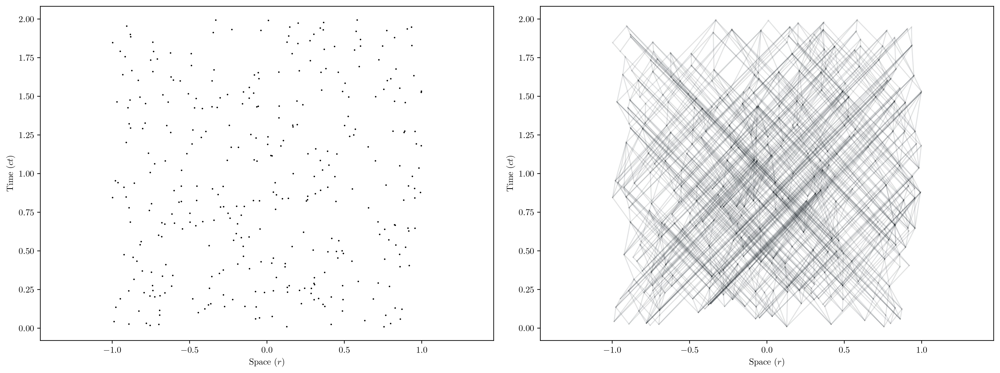
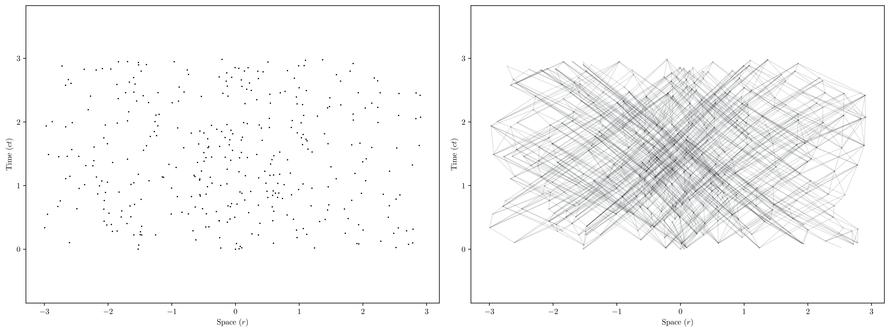
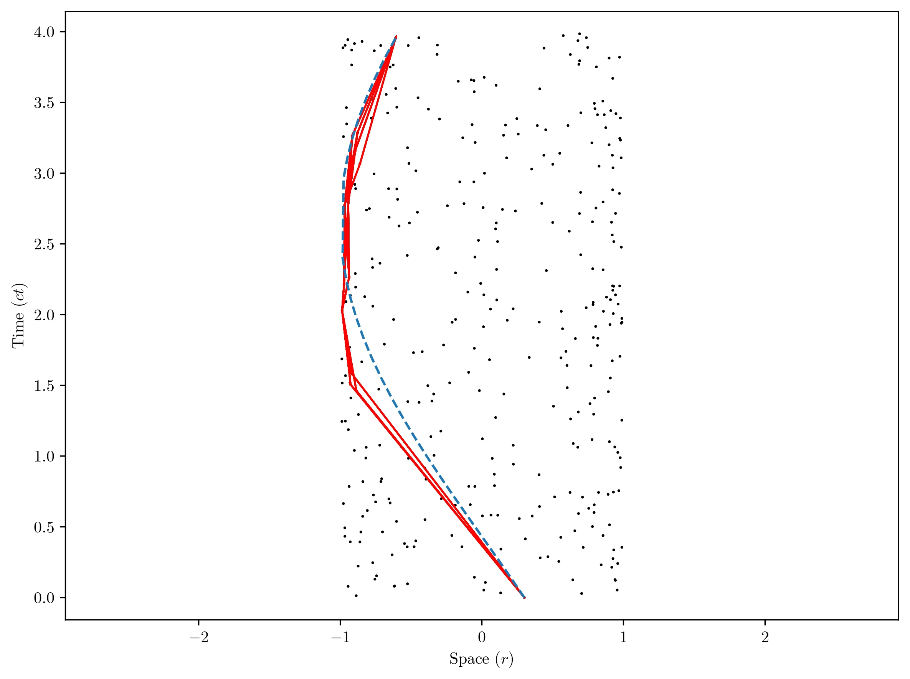

# Numerical Study on the Causal Set Theory Path-Geodesic Corresondence hypothesis
Given a set of points $\mathcal{C}$ in a manifold $\mathcal{M}$ and a causal relation $\preceq$ one can describe a path between two points of $\mathcal{C}$ as a sequence of points $x_0\preceq x_1 \preceq\dots \preceq x_N$ for $x_i\in\mathcal{C}$. The Path-Geodesic correspondence hypothesis suggests that in the continuum limit (in which the number point density approaches infinity); the maximal length path between two points will approaxh the trajectory followed by a geodesic along the manifold $\mathcal{M}$. This project (alongside its [accompanying research paper]([https://github.com/user/repo/blob/branch/other_file.md](https://github.com/Cano-Jones/Causal-Set-Theory-Path-Geodesics-Correspondence/blob/main/Numerical_Correspondence_Between_FLRW_Geodesics_in_Causal_Sets_and_the_Continuum.pdf))
) aims to test this hypothesis using a (1+1) FLRW background given by the differential line element $\text{d}s^2=\text{d}t^2$ $ \text{d}s^2=\text{d}t^2-a(t)\frac{\text{d}r^2}{1-\kappa r^2} $

$$
P_\rho(n,V)=\frac{(\rho V)^n}{n!}e^{-(\rho V)}
$$

    
    
Causet and corresponding Hasse Diagram on a Minkowskian background (a(t)=1 & κ=0).

    
    
Causet and corresponding Hasse Diagram on a Hyperbolic background (a(t)=1 & κ=-1).

    
    
Continuum (Blue) and Discrete (Red) geodesics in an Spherical background (a(t)=1 & κ=1).

